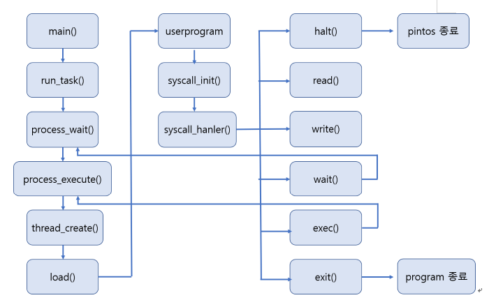
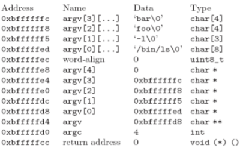
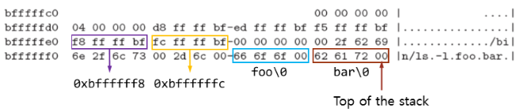
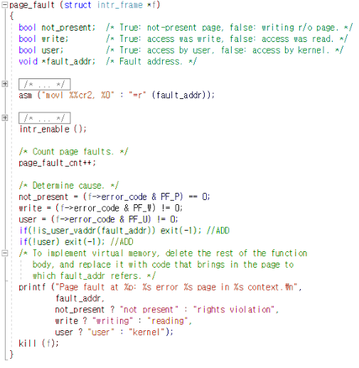
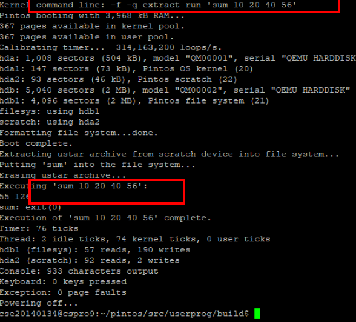

# OperatingSystem
Projects for Operating System in Sogang Univ.  
작성일자 : 2019-11-03

# 개발 목표
-	Pintos OS의 기초 코드를 사용하여 userprogram을 구현하는 것이 목표이다. Argument passing과 6개의 system call인 halt(), exit(), exec(), wait(), write(), read()를 구현하여 Pintos에서 userprogram을 동작할 수 있게 하였다. 추가적으로 피보나치 수열을 구하는 fibonacci()와 네 정수의 합을 구하는 sum_of_four_int() system call도 구현하였다.

# 개발 범위 및 내용

### 개발 범위

##### Argument Passing

입력받은 argument를 tokenizing하여 esp를 사용해 stack에 순서대로 쌓아준다.  
process.c의 내부에 load() 함수에서 argument passing을 구현했으며 strtok_r와 strlcpy로 parsing 해주었다.  

##### User Memory Access
User가 memeory access를 하는 과정에서 오류가 있을 경우 예외처리를 통해 pintos 프로그램을 종료해준다. eception.c의 page_fault()를 이용하여 처리해 주었다.  
처음에는 syscall.c에서 vaddr.h를 include한 후 is_user_vaddr() 함수를 사용하여 f->esp를 체크하여 진행해 보려 하였으나 kernel panic 발생으로 다른 방법으로 구현하였다. 

##### System Call 
system call handler 구현을 통해 stack에 쌓인 argument를 불러오고 halt, exit, exec, wait, read, write를 구현하였다. 나머지 경우와 다르게 exec에서는 따로 parsing을 해주었다.

- process.c, process.h, thread.c, thread.h, exception.c, userprog/syscall.c, syscall.h

- syscall-nr.h, sum.c, /lib/user/syscall.c, /lib/user/syscall.h

### 개발 내용

- Page는 virtual memory의 연속적인 영역이다. 운영체제에서 memory management를 위한 data의 최소 단위이고 크기는 4KB이다. 이는 20 bit의 page numer와 12bit의 offset으로 나뉜다. 각각의 process는 독립적인 user page의 집합을 가지며 이 page들은 user 영역인 PHYS_BASE의 아래 memory에 위치하게 된다.

- Thread는 cpu활용의 기본 단위이며 process의 흐름이다. 각각의 thread는 자신의 register state와 stack을 가지고 있고, thread를 식별할 수 있는 thread ID와 program counter도 포함한다. 한 process안에 여러 thread를 생성할 수도 있으며 이 경우에 code와 주소 공간, 자원 등을 공유하게 된다.

- User process가 kernel memory에 접근하는 것을 막기 위해 user pointer가 PHYS_BASE 아래 memory에 접근하고 있는지 확인하고 만약 그렇지 않다면(위의 memory에 접근) page_fault()함수를 호출하여 프로그램을 종료시킨다.

# 추진 일정 및 개발 방법

### 추진 일정

10/7 ~ 10/11 : ppt 및 pintos manual 분석

10/19 ~ 10/25 : Argument passing 구현

10/26 ~ 10/31 : system call, thread, process 구현

11/1 ~ 11/2 : 디버깅

11/3 : 보고서 작성

### 개발 방법

#####  Argument Passing

process.c에서 load() 함수에서 argument passing을 진행했고 process_execute 함수에서 filename이 parsing 되도록 해주었다. 

process_wait()은 파라미터로 들어온 child_tid가 parent의 child_tid와 일치하지 않거나 적절하지 않으면 종료한다. parent를 멈추고 exit_status를 받아오는데, child는 block된 상태라 exit_status를 가져올 수 없으므로 parent 내에서 child_exit_status를 생성하여 받아오도록 하였다.

부모가 존재하는 process가 process_exit에 접근하면 parent를 받아와 exit status를 넣어주고 parent를 unblock 해준다.

#####  User Memory Access

user가 null pointer를 넘겨주거나 mapping되지 않은 virtual memory를 접근하거나 PHYS_BASE 위의 memory를 접근하는 등 오류를 유발하려고 할 때 프로그램을 종료하기 위해 exception.c의 page_fault 함수를 수정하였다.

#### System Call

tack pointer인 esp가 가리키는 system call에 해당하는 값을 받아와 그 값에 해당하는 system call을 호출해낸다. system call에 해당하는 값은 syscall-nr.h에서 참고하였으며 syscall.c에 있는 syscall_handler() 함수에서 switch statement를 추가하여 구현하였다. 이 때, f->esp+n을 uint32_t로 casting해주었다. 

### 역할 분담

- 조예린 : Argument passing 구현, thread 수정, system call 구현, 디버깅

-	이영진 : 추가 system call 구현, 보고서 작성, 관련내용 조사, 디버깅




# 제작 내용

### Argument Passing

사용자의 명령어를 tokenize하여 stack memory에 차례로 넣게 된다. 이 때 esp를 통해 stack에 넣을 위치를 지정하고 넣어주게 된다. stack은 특성 상 Last in First out의 자료구조를 갖게 되므로 argument들을 역순으로 쌓아야 하며 이 stack에 들어가는 내용은 argument뿐만 아니라 word alignment용 공간, argv 포인터, 각 argument들의 string을 저장하는 배열의 초기 pointer, argc, fake return 값들이 필요하다. argument passing 후 stack에 load되는 예시는 아래와 같다.

- “/bin/ls -l foo bar” 입력시



- hex_dump 수행 결과



### User Memory Access



if(!is_user_vaddr(fault_addr)) exit(-1);

if(!user) exit(-1);

위 두 줄을 추가하여 user의 오류를 차단하였다.


### System Calls(Additional 포함)

System Call은 argument parsing에서 parsing한 command를 이용하여 syscall_handler에서 call한 다음 esp가 가리키는 memory를 사용하여 system call에 필요한 parameter를 지정한다.


##### void halt(void)

```c
void halt(void) {
	shutdown_power_off();
}
```

pintos를 종료시키는 함수이다. shutdown_power_off()를 호출한다.


##### int exit(int status)

```c
int exit(int status) {
	thread_current()->exit_status = status;
	thread_exit();
	return status;
}
```

exit할 thread의 종료 상태를 갖고있는 변수 status를 parameter로 받는다. 받은 parameter를 exit할 thread의 부모 thread에게 전달한다. 그 후 thread_exit() 함수를 호출해 thread를 종료한다.


##### tid_t exec(const char *cmd_line)

```c
tid_t exec(const char *cmd_line) {
	/* ----parsing cmd_line---- */
	char* token;
	char tmp[30][10]={};
	char *ptr[2];
	int k=0;
	char temp_file_name[30];
	char tmp_argv[30][10] = {};
	int tmp_argc = 0;
	strlcpy(temp_file_name, cmd_line, strlen(cmd_line)+1);
	token = strtok_r(temp_file_name, " ", &ptr[0]);
	
	while(token != NULL) {
		strlcpy(tmp[k], token, strlen(token)+1);
		token = strtok_r(tmp[k], " ", &ptr[1]);
		while(token != NULL) {
			strlcpy(tmp[k], token, strlen(token)+1);
			token = strtok_r(NULL, " ", &ptr[1]);
		}
		token = strtok_r(NULL, " ", &ptr[0]);
		if(token == NULL) break;
		strlcpy(tmp_argv[tmp_argc++], token, strlen(token)+1);
		k++;
	}
    /* ----parsing cmd_line done---- */
    
    struct file* file=NULL;
    file = filesys_open(temp_file_name);
    if(file == NULL) {
        printf("load: %s: open failed\n", temp_file_name);
        return -1;
    }
    else return process_execute(cmd_line);
}
```

filename의 정보를 읽어와 process_execute()함수로 전달하여 수행한다. 파일이 없는 경우(no such file)에 대한 예외처리를 해주었다.


##### int read(int fd, void *buffer, unsigned size)

```c
int read(int fd, void *buffer, unsigned size) {
    int i;
    if(fd==0) {
        for(i=0;i<size;i++) buffer = input_getc();
        return size;
    }
    return -1;
}
```

이번 프로젝트에서는 standard input/output만 구현하기 때문에 file descripter(fd)가 0인 경우만 구현하였다. 정상적인 입력을 했을 경우(fd=0) 받은 size만큼을 return한다. 그렇지 않을 경우 -1을 return한다. 


##### int write(int fd, const void *buffer, unsigned size)

```c
int write(int fd, const void *buffer, unsigned size) {
    if(fd==1) {
        putbuf(buffer, size);
        return size;
    }
    return -1;
}
```

위와 마찬가지로 fd=1인 경우만 구현하였다. 나머지의 경우는 비정상적인 케이스로 간주한다. 


##### int sum_of_four_integer(const char* a, const char* b, const char* c, const char* d)

```c
int sum_of_four_integer(const char* a, const char* b, const char* c, const char* d) {
    return atoi(a) + atoi(b) + atoi(c) + atoi(d);
}
```

네 정수를 받은 후 그 합을 출력한다. parameter는 char로 들어오기 때문에 atoi()함수를 사용하여 int로 변환해준다.


##### int fibonacci(const char* a)

```c
int fibonacci(const char* a) {
    int a, b, num, ans, i;
    a = b = ans = 1;
    num = atoi(n);
    if(num > 2) {
        for(i=0;i<num-2;i++) {
            ans = a+b;
            a=b;
            b=ans;
        }
    }
    return ans;
}
```

정수를 하나 입력 받아 그 값에 해당하는 번째의 피보나치 수열 값을 출력한다.


# 시험 및 평가 내용



# 소감

##### 조예린

주어진 코드의 양이 방대해 해당 내용을 이해하는 데에 시간이 매우 많이 걸렸다. 특히 처음에 들어온 내용들이 어떻게 핀토스 내에서 쓰레드를 생성하고, 자식 쓰레드를 기다리며, 종료되는 지의 순서를 파악하는 것이 어려웠다. 이제는 왜 우리 팀의 코드가 돌아가는지는 이해가 되지만, 어떤 비슷한 함수로 바꾸었을 때(가령 process_wait에서 sema_down을 넣었을 때 등) 왜 안돌아가는 지 등은 이해할 수 없어 다음 프로젝트에 대한 걱정이 앞선다. 서너 줄을 작성하기 위해 관련된 몇백 줄의 코드를 읽어보고, 명세서를 읽어보고, 모든 라인마다 printf를 넣어보며 디버깅을 하는 과정이 매우 고되고 혼란스러웠지만, 테스트 케이스가 통과할 때에는 그만큼 보람찼다. 다음 프로젝트도 재미있었으면 좋겠다.

##### 이영진

linux와 pintos에 대한 기본 지식이 부족하다 보니 pintos manual과 프로젝트에 대한 내용을 이해하는데 무척 오래 걸렸다. 처음에는 무엇을 해야 하는지조차 파악하기 힘들어서 애를 먹었다. ppt를 여러 번 읽어보고 기존의 코드를 분석하며 구글링을 통해 어느정도 틀이 잡혀갔다. 또, 주위 친구들과 조원의 도움으로 프로젝트를 조금은 이해할 수 있게 되었다. 까다로운 프로젝트인 만큼 시간을 많이 투자하여 남은 프로젝트를 진행하여야 할 것 같다.
